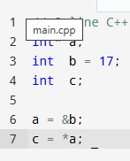
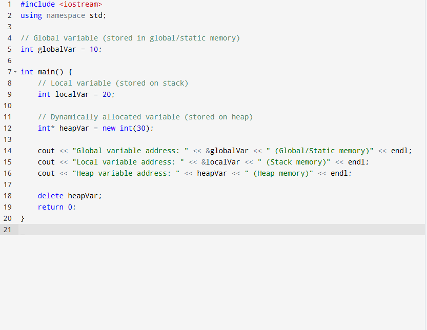
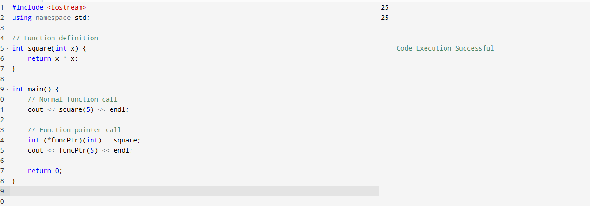
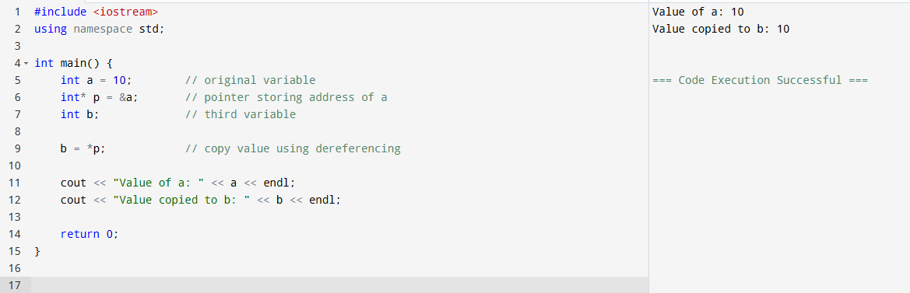
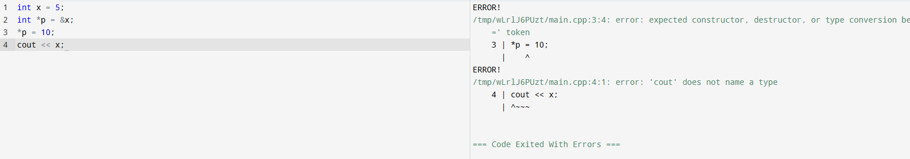
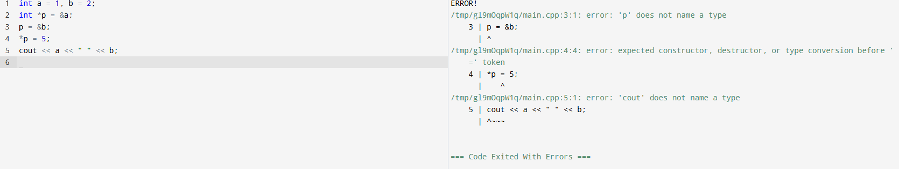
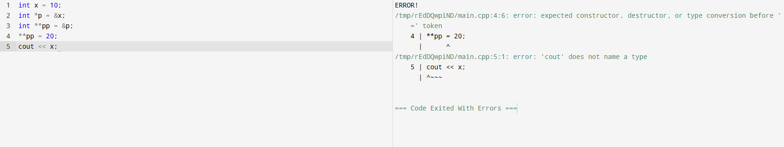
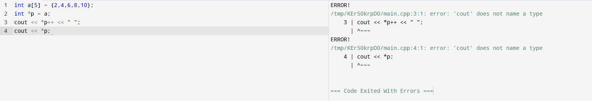
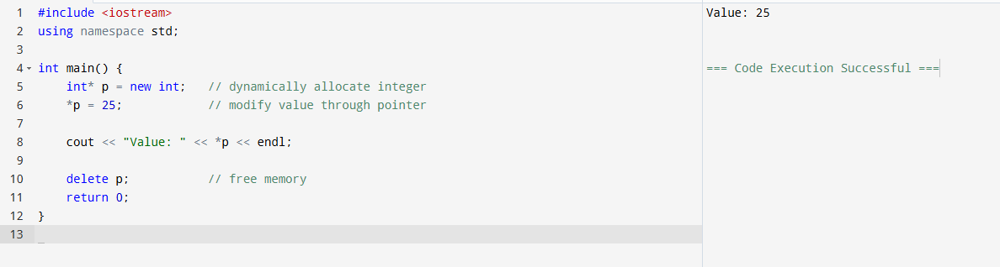

# pointers

# QUESTION 
# Write a C++ program that: Declares one global variable Declares one local variable inside main() Dynamically allocates one integer using new Print the addresses of all three and identify which memory region each belongs to.

# Write a function square(int) and call it: Normally Using a function pointer

# Write a program to print: Value of a variable Address of the variable Value stored in the pointer 

# Write a program where a pointer stores the address of another variable and copies its value into a third variable using dereferencing.

# What will be the output:int x = 5; int *p = &x; *p = 10; cout << x;

# int a = 1, b = 2; int *p = &a; p = &b; *p = 5; cout << a << " " << b;

# int x = 10;int *p = &x; int **pp = &p; **pp = 20; cout << x;

# int a[5] = {2,4,6,8,10}; int *p = a; cout << *p++ << " "; cout << *p;

# Write a program to swap two numbers using pointers.

# Implement a simple dynamic integer variable that: Is created using new Modified through a pointer Properly deleted

